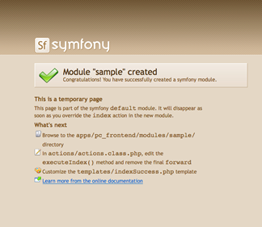
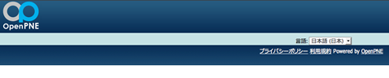
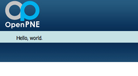
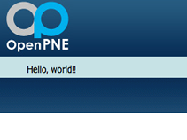

==================
4日目 ページを作る
==================

:Author: Shogo Kawahara <Twitter: @ooharabucyou>
:Date: 2010-12-04

プラグインで、オリジナルのページを作成します。

.. note:: 関連する symfony のドキュメント

  * `A Gentle Introduction to symfony | 第4章 ページ作成の基本 <http://www.symfony-project.org/gentle-introduction/1_4/ja/04-The-Basics-of-Page-Creation>`_

アクションとテンプレート
========================

前回のスケルトン作成で、既にアクションが作られています。このクラスに sample モジュールのアクションを記していきます。

``$your_plugins_dir/apps/pc_frontend/modules/sample/actions/actions.class.php``

.. code-block:: php

  <?php

  class sampleActions extends sfActions
  {
    public function executeIndex(sfWebRequest $request)
    {
      $this->forward('default', 'module');
    }
  }

.. note::

  このドキュメントでは、ジェネレーターにより作成されたコメント行を省略しています。

ジェネレーターが作成したものには、indexアクションと、それに対応するテンプレートファイルが最初から用意されています。

executeIndex() が実際に処理されるアクションです。今は、default/module というアクションにフォワード(転送)する処理が書かれています。default/module は symfony が用意しているサンプルページです。

今の時点で、 ``http://sns.example.com/sample/index`` にアクセスすると以下のようなページが表示されます。

対応したテンプレートファイル (``$your_plugins_dir/apps/pc_frontend/modules/sample/templates/indexSuccess.php``) の内容を表示したいので、フォワードを行わないように変更します。

``$your_plugins_dir/apps/pc_frontend/modules/sample/actions/actions.class.php``

.. code-block:: php

  <?php

  class sampleActions extends sfActions
  {
    public function executeIndex(sfWebRequest $request)
    {
    }
  }

今の時点で、 ``http://sns.example.com/sample/index`` にアクセスすると以下のようなページが表示されます。特に何も表示されないのは、indexSuccess.php に何も書いていないからです！これでは寂しいので、何かを表示してみます。

``$your_plugins_dir/apps/pc_frontend/modules/sample/templates/indexSuccess.php``

.. code-block:: php

  Hello, world.

今の時点で、 ``http://sns.example.com/sample/index`` にアクセスすると以下のようなページが表示されます。

sampleモジュールにアクションを追加するときは、 ``executeXXX()`` (XXXはアクション名) というメソッドを追加します。

``hello`` というアクションを追加しましょう。

``$your_plugins_dir/apps/pc_frontend/modules/sample/actions/actions.class.php``

.. code-block:: php

  <?php

  class sampleActions extends sfActions
  {
    public function executeIndex(sfWebRequest $request)
    {
    }

    public function executeHello(sfWebRequest $request)
    {
    }
  }

``hello`` に対応するテンプレートが必要になるので、以下のファイルを作成します。

``$your_plugins_dir/apps/pc_frontend/modules/sample/templates/helloSuccess.php``

.. code-block:: php

  Hello, world!!

今の時点で、 ``http://sns.example.com/sample/hello`` にアクセスすると以下のようなページが表示されます。

大まかなページの作成の流れは理解できたかと思います。

ログインが必要なページを作る
============================

現状では、ログインしなくても上で作成したページを見ることができます。仮に、クローズSNSでメンバーの情報を表示するとしたらこのままではいけません。

ログインが必要なモジュールを作成するのは、ごく簡単です。

``$your_plugins_dir/apps/pc_frontend/modules/config`` ディレクトリを作成し、以下の設定ファイルを作成します。

``$your_plugins_dir/apps/pc_frontend/modules/sample/config/security.yml``

::

  all:
    is_secure: on
    credentials: SNSMember

.. note::

  設定ファイルはYAMLを利用します。インデントを使い階層構造を表すデータ形式です。インデントはタブではなくスペースを利用することに気をつけてください。

  加えて以下の資料を読むとより理解が深まるでしょう。

  * `YAML1.2仕様書(英語) <http://www.yaml.org/spec/1.2/spec.html>`_
  * `A Gentle Introduction to symfony | 第5章 - symfony を設定する <http://www.symfony-project.org/gentle-introduction/1_4/ja/05-Configuring-Symfony>`_

設定ファイルの内容はキャッシュされるので、追加や変更を行った場合には symfony のキャッシュを削除しましょう。

::

  $ cd $openpne_dir
  $ symfony cc

これで、 http:/sns.example.com/sample/* はログインしないと見られないようになっているかと思います。

アクションからテンプレートに値を渡す
====================================

ログインしないとページが見られない状態になったので、ログイン中のメンバーのニックネームをアクションからテンプレートに渡してみましょう。 ``executeHello()`` に1行追加して、 ``helloSuccess.php`` も少し変更します。

``$your_plugins_dir/apps/pc_frontend/modules/sample/actions/actions.class.php``

.. code-block:: php-inline

    public function executeHello(sfWebRequest $request)
    {
      $this->nickname = $this->getUser()->getMember()->getName();
    }

``$your_plugins_dir/apps/pc_frontend/modules/sample/templates/helloSuccess.php``

.. code-block:: php

  Hello, <?php echo $nickname ?>.

アクション内で、 ``$this->getUser()->getMember()->getName()`` とすることで、ログイン中のメンバーのニックネームを取り出すことができます。

また、アクション内で ``$this->xxxx`` に値を代入すると、テンプレート内で ``$xxxx`` として利用ができます。テンプレートに渡ったパラメータはエスケープが完了しています。

.. warning::

  データの取り出しはアクション内で行うことを心がけましょう。
  テンプレート内で取り出したデータは自動的にエスケープされません。
  よって、XSS を引き起こしてしまうかもしれません。

ログインした上で、 ``http://sns.example.co/sample/hello`` にアクセスしてみましょう。以下のようになります。

.. image:: images/s4-5.png

TIPS: 上手くうごきません...
===========================

画面が表示されない!
-------------------

何らかの問題が起きて、画面が表示されなかったり、中途半端に出力されることがしばしばあります。
通常の環境では、セキュリティ上の理由からエラーメッセージを表示しないようにしています。

もしも、出力されているエラーを見たい場合は、dev (開発用) 環境にアクセスしましょう。

``http://sns.example.com/アプリケーション名_dev.php`` からアクセスする事ができます。

例 ::

  http://sns.example.com/pc_frontend_dev.php

.. warning:: 実際の運用環境では、セットアップドキュメントの通り開発環境を利用出来ないようにしてください。

  ::

    $ cd $openpne_dir
    $ php symfony project:clear-controllers

変更が反映されない!
-------------------

設定ファイルのキャッシュが残っているため、変更が反映されないことがあります。

そのようなときは、まずはキャッシュを消してみてください。

::

  $ cd $openpne_dir
  $ symfony cc

また明日
========

明日は、ガジェットを取り扱います。
