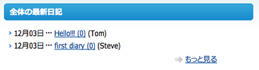
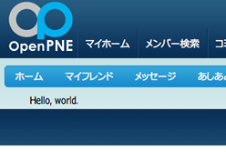
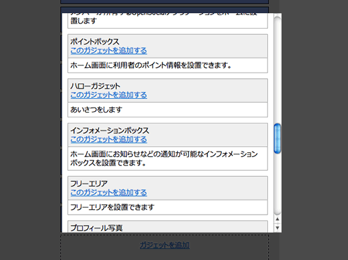
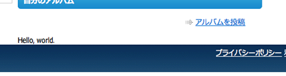

================
5日目 ガジェット
================

:Author: Shogo Kawahara <Twitter: @ooharabucyou>
:Date: 2010-12-05

オリジナルのガジェットを作成します。

.. note:: 関連する symfony のドキュメント

  * `A Gentle Introduction to symfony | 第7章 ビューレイヤーの内側 <http://www.symfony-project.org/gentle-introduction/1_4/ja/07-Inside-the-View-Layer>`_

ガジェットとは
==============

OpenPNE3における **ガジェット** とは、ホーム画面やプロフィール画面などに情報を表示するための部品です。SNS管理者は、管理画面からデザイン設定 -> ガジェット設定 で自身のSNSにあったガジェットの配置と選択をすることができます。

**ガジェットの例 (フレンド日記ガジェット)**

ガジェットは以下の11種類があります。

ホーム画面ガジェット (gadget)
  ログイン後のホーム画面に表示されるガジェットです。ログインしているユーザのフレンドリストや、最新の情報の通知を行うためのインフォメーションボックスが用意されています。

プロフィール画面ガジェット (profile_gadget)
  SNSメンバーのプロフィール画面に表示されるガジェットです。プロフィール情報などが用意されています。

ログイン画面ガジェット (login_gadget)
  ログイン画面のためのガジェットです。

サイドバナーガジェット (side_banner_gadget)
  右側の領域に表示されるガジェットです。

携帯版ホームガジェット (mobile_gadget)
  ホーム画面ガジェットの携帯版です。

携帯版プロフィールガジェット (mobile_profile_gadget)
  プロフィール画面ガジェットの携帯版です。

携帯版ログイン画面ガジェット (mobile_login_gadget)
  ログイン画面ガジェットの携帯版です。

携帯版ヘッダーガジェット (mobile_header_gadget)
  携帯版画面の最上部に表示されるガジェットです。

携帯版フッターガジェット (mobile_footer_gadget)
  携帯版画面の最下部に表示されるガジェットです。

デイリーニュース(PC向け)ガジェット (daily_news_gadget)
  デイリーニュースに使われるガジェットです。

デイリーニュース(携帯向け)ガジェット (mobile_daily_news_gadget)
  デイリーニュース(携帯向け)に使われるガジェットです。

.. note::  Web全体公開とガジェット

  SNSによっては、メンバーのプロフィール情報をWeb全体に公開できるようにしているでしょう。
  (管理画面から SNS設定 -> 一般的な設定 で、メンバーのプロフィールページの公開範囲を設定できます。)

  しかし、ガジェットによっては、Webに公開したくない場合が存在するかもしれません。
  そこで、ガジェット単位で表示にログインが必要かどうかをSNS管理者が選択する機能があります。

  .. image:: images/s5-2.png

.. note:: デイリーニュース・誕生日お知らせメールのパフォーマンス問題

  未だに解決されていない問題ですが、OpenPNE3本体のデイリーニュースと誕生日お知らせメールは多くのメモリーを消費する上、
  遅いために大規模なSNSには適しません。おそらく配信処理は途中で止まってしまうでしょう。

  そこで、opLiteMailTaskPlugin が存在します。
  モバイル向けには配信されない・ガジェットを利用せず日記・コミュニティトピック最新情報のみ配信と、機能は限定ですが
  大規模なSNSでもデイリーニュースが活用出来るように設計されています。

  ぜひお試しください。
  http://plugins.openpne.jp/package/opLiteMailTaskPlugin

コンポーネント
==============

ガジェットは、symfony のコンポーネント機能が基礎にあります。symfony のコンポーネントはアクションを伴うページの1部品に使われるものです。

試しにコンポーネントを作成してみましょう。

``$your_plugins_dir/apps/pc_frontend/modules/sample/actions/components.class.php`` を新たに作成します。

.. code-block:: php

  <?php

  class sampleComponents extends sfComponents
  {
    public function executeHelloGadget(sfWebRequest $request)
    {
    }
  }

アクションの場合と同じく、 ``executeXXXX()`` (XXXXはコンポーネント名) というメソッドがアクションになります。

テンプレート名は ``_XXXX.php`` となります。

``helloGadget`` コンポーネントに対応するテンプレートは ``_helloGadget.php`` ということです。

``$your_plugins_dir/apps/pc_frontend/modules/sample/templates/_helloGadget.php`` を新たに作成します。

.. code-block:: php

  Hello, world.

コンポーネントを実際に利用する場合は、テンプレート ``include_component()`` 関数を利用します。

前回作成したテンプレートを、すこし変えてみます。

``$your_plugins_dir/apps/pc_frontend/modules/sample/templates/indexSuccess.php``

.. code-block:: php

  <?php include_component('sample', 'helloGadget'); ?>

この状態で ``http://sns.example.com/sample/index`` を見ると以下のようになります。

.. note::

  symfony のコンポーネントについて詳しくなりたいときは、以下のものを読むと良いでしょう。

ガジェット作成
==============

今回は、ホーム画面向けのガジェットを作ります。

コンポーネントの作成
--------------------

上の手順に従って、ガジェットに使うコンポーネントを作成します。
今回は、上で作ったコンポーネントを、そのままガジェットにしましょう。

ガジェット定義
--------------

プラグインでガジェットの定義を行う場合は、 ``$your_plugins_dir/config/*`` にガジェット定義ようのYAMLファイルを設置します。

ファイル名は、上記のガジェットの種類でカッコで示しているものを使います。ホーム画面向けの場合は ``gadget.yml`` という名前になります。

``$your_plugins_dir/config/gadget.yml``

::

  helloGadget: # ガジェット名
    caption:
      ja_JP: "ハローガジェット" # ガジェット名称(日本語)
    description:
      ja_JP: "あいさつをします" # ガジェット説明(日本語)
    components: [sample, helloGadget] # [module名, component名]

.. note:: YAMLの構文上、#以降はコメントになります。実際には入力しなくてもかまいません。

ガジェット名は、他のガジェットと被らない一意なものにしてください。

ここで、設定ファイルを追加したのでキャッシュを削除します。

::

  $ cd $openpne_dir
  $ php symfony cc

ガジェットを使う
================

管理画面から、デザイン設定 -> ガジェット設定 -> ホーム画面ガジェット設定で目的のガジェットを追加します。

ホーム画面に、先ほど作成したコンポーネントが表示されるはずです。

また明日
========

明日は、データベースモデルの定義方法を取り扱います。
