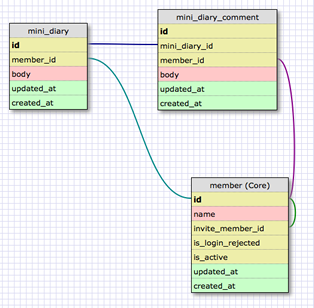

==============================
6日目 データベースモデルの作成
==============================

:Author: Shogo Kawahara <Twitter: @ooharabucyou>
:Date: 2010-12-06

今日は、プラグインが使うデータベースモデルを定義・作成します。

OpenPNE3.6では、ORMとして `Doctrine 1.2 <http://www.doctrine-project.org/>`_ を利用しています。

.. note:: 関連する symfony のドキュメント

  * `A Gentle Introduction to symfony | 第8章 モデルレイヤーの内側 <http://www.symfony-project.org/gentle-introduction/1_4/ja/08-Inside-the-Model-Layer>`_

定義を行う
==========

以下のようなモデルを持つ、シンプルな日記機能を想定してみます。

mini_diary

+-------------+------------+----------+-------------------+
| column name | type       | not null | 備考              |
+=============+============+==========+===================+
| id          | integer    | yes      | 主キー            |
+-------------+------------+----------+-------------------+
| member_id   | integer(4) | yes      | member の外部キー |
+-------------+------------+----------+-------------------+
| body        | string     | yes      |                   |
+-------------+------------+----------+-------------------+
| updated_at  | datetime   | yes      |                   |
+-------------+------------+----------+-------------------+
| created_at  | datetime   | yes      |                   |
+-------------+------------+----------+-------------------+

mini_diary_comment

+---------------+------------+----------+-----------------------+
| column name   | type       | not null | 備考                  |
+===============+============+==========+=======================+
| id            | integer    | yes      | 主キー                |
+---------------+------------+----------+-----------------------+
| member_id     | integer(4) | yes      | member の外部キー     |
+---------------+------------+----------+-----------------------+
| mini_diary_id | integer    | yes      | mini_diary の外部キー |
+---------------+------------+----------+-----------------------+
| body          | string     | yes      |                       |
+---------------+------------+----------+-----------------------+
| updated_at    | datetime   | yes      |                       |
+---------------+------------+----------+-----------------------+
| created_at    | datetime   | yes      |                       |
+---------------+------------+----------+-----------------------+

**member** は SNSメンバー情報を管理するモデルで、 *$openpne_dir/config/doctrine/schema.yml* で定義されています。

プラグインの方では **mini_diary** と **mini_diary_comment** を定義します。

*$your_plugins_dir/config/doctrine* を作成して、以下のファイルを作成します。

*$your_plugins_dir/config/doctrine/schema.yml*

::

  options:
    charset: utf8

  MiniDiary:
    actAs: [Timestampable]
    columns:
      member_id: { type: integer(4), notnull: true }
      body:      { type: string, notnull: true }
    relations:
      Member: { foreign: id, onDelete: cascade }

  MiniDiaryComment:
    actAs: [Timestampable]
    columns:
      member_id:     { type: integer(4), notnull: true }
      mini_diary_id: { type: integer, notnull: true }
      body:          { type: string, notnull: true }
    relations:
      Member: { foreign: id, onDelete: cascade }
      MiniDiary: { foreign: id, onDelete: cascade }

.. note::

  Doctrine には Timestampable というビヘイビアが用意されており、
  actAs により有効にすると、created_at と updated_at カラムを自動的に追加してくれます。

  created_at はレコード作成時に現在時刻がセットされ、 updated_at は レコード更新/作成時に現在時刻がセットされます。

  詳しい記述方法や、利用出来る型の詳細は以下を確認してください。

  * `Doctrine - Doctrine ORM for PHP - YAML Schema Files <http://www.doctrine-project.org/projects/orm/1.2/docs/manual/yaml-schema-files/ja>`_
  * `Doctrine - Doctrine ORM for PHP - Definition to Models <http://www.doctrine-project.org/projects/orm/1.2/docs/manual/defining-models/ja>`_

テーブル作成
============

開発時の段階ではテーブルを追加する機能がないため、データベースモデルを再構築して
一度データベースを初期化します。

この際、 **データベースは一度削除される** ことに注意してください。

::

  $ cd $opepne_dir
  $ php symfony doctrine:build --all --and-load

これにより、インストールしたデータベースに *mini_diary* と *mini_diary_comment* が追加されています。

また明日
========

明日は、実際にデータのCRUDをやります。
