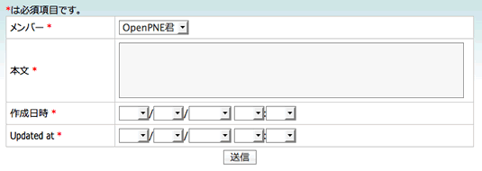
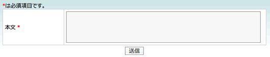
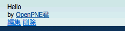

==============
9日目 フォーム
==============

:Author: Shogo Kawahara <Twitter: @ooharabucyou>
:Date: 2010-12-09

今日は、フォームについて学びます。

.. note:: 関連する symfony のドキュメント

  * `A Gentle Introduction to symfony | 第10章 フォーム <http://www.symfony-project.org/gentle-introduction/1_4/ja/10-Forms>`_

フォームクラス
==============

symfony では、フォームフレームワークを持っています。

フォームを利用する場合は、1つのフィールドを定義する "ウィジェット" と、値が正しいかどうかを検証するための "バリデーター" をまとめて管理したフォームクラスを作ります。

symfony のフォームフレームワークは以下のような利点があります。

* CSRF保護機能がある
* モデルに基づいたフォームを活用できる

モデルに基づいたフォームの利用
==============================

モデル作成時に、モデルに基づいたフォームが作成されています。

実際に ``MiniDiary`` を作成するフォームを作りましょう。

フォームクラスの変更
--------------------

``MiniDiary`` の作成・編集用フォームは ``MiniDiaryForm`` というクラスで定義しています。

今の段階で MiniDiaryForm を使うと以下のようになります。

全てのカラムが入力可能な状態になっています。このため、使うフィールドを制限します。

``MiniDiaryForm`` の挙動をプラグインから変更する場合は、 ``PluginMiniDiaryForm`` を編集します。

このクラスは ``$your_plugins_dir/lib/form/doctrine`` に生成されています。

``$your_plugins_dir/lib/form/doctrine/PluginMiniDiaryForm.class.php``

.. code-block:: php

  <?php

  abstract class PluginMiniDiaryForm extends BaseMiniDiaryForm
  {
    public function setup()
    {
      // デフォルトのフォームのセットアップを行います
      parent::setup();

      // 編集できるのは body フィールドだけ
      $this->useFields(array('body'));
    }
  }

アクションとテンプレート
------------------------

アクションとテンプレートを編集して、実際に実際にフォームを使ってみます。

``$your_plugin_dir/apps/pc_frontend/modules/miniDiary/actions/actions.class.php`` の一部を変更します。

.. code-block:: php-inline

    // miniDiaryの作成画面
    public function executeNew(sfWebRequest $request)
    {
      $this->form = new MiniDiaryForm();
    }

    // miniDiaryの作成
    public function executeCreate(sfWebRequest $request)
    {
      // 新しいオブジェクトの作成
      $miniDiary = new MiniDiary();
      $miniDiary->setMemberId($this->getUser()->getMemberId());

      // Doctrine により作られたフォームは オブジェクトを渡せる
      $this->form = new MiniDiaryForm($miniDiary);

      // $request->getParameter() でパラメータを取得 GET/POST 共通
      // bind() でパラメータをフォームにバインドします。
      $this->form->bind($request->getParameter('mini_diary'));

      // CSRFトークンや入力値が正しいかどうかを調べる
      if ($this->form->isValid())
      {
        // 問題なければ値を保存して、ミニ日記表示ページにリダイレクト
        $this->form->save();
        $this->redirect('@mini_diary_show?id='.$miniDiary->id);
      }

      // 入力値に問題があれば、newアクションのテンプレートを利用する
      $this->setTemplate('new');
    }

    // 省略..

    // miniDiaryの表示
    public function executeShow(sfWebRequest $request)
    {
      // sfDoctrineRoute を使っている時は、マッチしたオブジェクトが
      // 次のように取得できます。
      $this->miniDiary = $this->getRoute()->getObject();
    }

``$your_plugin_dir/apps/pc_frontend/modules/miniDiary/templates/newSuccess.php``

.. code-block:: php

  <?php op_include_form('mini_diary_form', $form, array('url' => url_for('@mini_diary_create'))) ?>

``op_include_form()`` ヘルパー関数を利用することにより、簡単にフォームを埋め込むことができます。CSRFトークン埋込みの処理などは自動的に行われます。

この関数により、入力必須の強調、共通デザインの利用を行うことができます。

* 第1引数には、IDを指定します。これは後に紹介するテンプレート拡張をする際に役立ちます。
* 第2引数には、フォームのインスタンスを指定します。
* 第3引数には、配列でオプションを指定します。以下のオプションを使うことができます。

  - url : Formのアクション先URLを指定します。デフォルトは現在のURLです。
  - method : methodを指定します。デフォルトは "post" です。
  - button : ボタンのキャプションを指定します。デフォルトは '送信' です。
  - firstRow : フォーム用テーブルの冒頭に追加する文字列。
  - lastRow : フォーム用テーブルの末尾に追加する文字列。
  - isMultipart : フォームの属性として enctype="multipart/form-data" を追加するかを指定します。デフォルトは false です。
  - mark_required_field : 必須を強調するかを指定します。デフォルトは true です。

また、url_for() ヘルパー関数で、アクセスすることの出来るURLを返します。

``$your_plugin_dir/apps/pc_frontend/modules/miniDiary/templates/showSuccess.php``

.. code-block:: php

  

  <?php
  echo nl2br($miniDiary->getBody())
  ?>
  

   by
  <?php
  echo op_link_to_member($miniDiary->getMember())
  ?>

  <?php if ($miniDiary->getMemberId() === $sf_user->getMemberId()): ?>
  

  <?php echo link_to('編集', '@mini_diary_edit?id='.$miniDiary->getId()) ?>
   <?php echo link_to('削除', '@mini_diary_delete_confirm?id='.$miniDiary->getId()) ?>
  

  <?php endif; ?>

``op_link_to_member()`` ヘルパー関数で、ニックネームの表示とプロフィール画面へのリンクを簡単に行うことができます。

これで、 http://sns.example.com/miniDiary/new へアクセスしましょう。以下のようになります。

フォームを送信すると、無事に保存が完了し、表示されるのがわかります。

削除のCSRF保護
==============

削除処理にもCSRF保護を行う必要があります。

``$your_plugin_dir/apps/pc_frontend/modules/miniDiary/actions/actions.class.php`` の一部を変更します。

.. code-block:: php-inline

    // miniDiaryの削除確認
    public function executeDeleteConfirm(sfWebRequest $request)
    {
      $this->miniDiary = $this->getRoute()->getObject();

      // 日記作成者でないなら 404
      $this->forward404Unless($this->miniDiary->getMemberId() === $this->getUser()->getMemberId());
    }

    // miniDiaryの削除
    public function executeDelete(sfWebRequest $request)
    {
      $miniDiary = $this->getRoute()->getObject();

      // 日記作成者でないなら 404
      $this->forward404Unless($miniDiary->getMemberId() === $this->getUser()->getMemberId());
      // CSRFの正当性確認
      $request->checkCSRFProtection();

      // 削除
      $miniDiary->delete();

      $this->redirect('@mini_diaries');
    }

この処理は、日記作成者以外はされてはこまるので、日記作成者でない場合は ``forward404Unless()`` により 404にするようにしています。

``$request->checkCSRFProtection()`` を使うと、リクエストにあるCSRFトークンの正当性確認を行い、正しくない場合はエラー画面に遷移します。

``$your_plugins_dir/apps/pc_frontend/modules/miniDiary/templates/deleteConfirmSuccess.php``

.. code-block:: php

  <?php slot('body') ?>
  以下の日記を削除しますか。
  
<?php echo $miniDiary->getBody() ?>

  <?php end_slot() ?>

  <?php op_include_yesno('mini_diary_delete_confirm',
    new BaseForm(),
    new BaseForm(array(), array(), false),
    array(
      'body' => get_slot('body'),
      'yes_url' => url_for('@mini_diary_delete?id='.$sf_params->get('id')),
      'no_url'  => url_for('@mini_diary_show?id='.$sf_params->get('id')),
      'no_method' => 'get',
    )
  ) ?>

ここでは ``op_include_yesno()`` というヘルパー関数を利用しています。この関数は、2択で何かを尋ねることができるフォームを埋め込みます。

* 第1引数には、IDを指定します。
* 第2引数には、"はい" 用のフォームインスタンスを指定します。
* 第3引数には、"いいえ" 用のフォームインスタンスを指定します。
* 第3引数には、配列でオプションを指定します。以下のオプションを使うことができます。

  - body: 選択肢の上に表示されるメッセージです。
  - yes_button : "はい" の送信ボタンのキャプションです。
  - no_button : "いいえ" の送信ボタンのキャプションです。
  - yes_url : "はい" のフォームのアクション先URLです。
  - no_url : "いいえ"のフォームのアクション先URLです。
  - yes_method: "はい" のフォームのメソッドです。デフォルトは "post" です。
  - no_method: "いいえ" のフォームのメソッドです。デフォルトは "post" です。

ここで、 ``BaseForm`` のインスタンスを渡している理由は、CSRFトークンがこのインスタンスにより生成されるからです。

また、"いいえ" 用のフォームでは GET で、ミニ日記表示ページに遷移させたいだけです。そのため、コンストラクタの第3引数に false を渡します。
この場合、CSRFトークンは埋めこまれません。

これで、削除が可能になります。

.. image:: images/s9-4.png

また明日
========

明日は、開発をするためにダミーのメンバーやコミュニティを生成する方法を紹介します。
