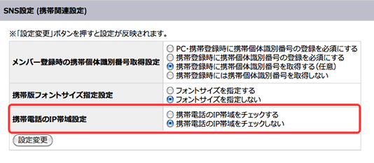
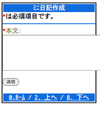
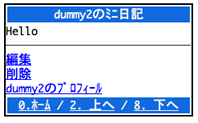

===============
12日目 モバイル
===============

:Author: Shogo Kawahara <Twitter: @ooharabucyou>
:Date: 2010-12-12

OpenPNEの特徴は、なんといってもモバイルの対応にあります。

プラグインからの対応も、PC向けと同じような手法で開発を行うことができます。この時、マルチバイト文字はUTF-8で保存します。
OpenPNEは、出力時に携帯端末向けの文字コードに自動変換します。

また、ユーザからの入力値も自動的にUTF-8に変換されます。

そのため、特別な場合で無い限り、アクションで文字コードを意識する必要はありません。

スケルトンの作成
================

プラグインに、モバイル向けの ``mobile_frontend`` アプリケーションのスケルトンを作成します。

``opGenerate:app`` タスクを使いましょう。

::

  $ cd $openpne_dir
  $ symfony opGenerate:app opSamplePlugin mobile_frontend

モバイル向けに ``miniDiary`` モジュールのスケルトンも作成しましょう。

``opGenerate::module`` タスクを使いましょう。

::

  $ symfony opGenerate:module opSamplePlugin mobile_frontend miniDiary

ディレクトリを確認しましょう。

プラグインの ``apps/`` ディレクトリに、新しく ``mobile_frontend/`` が増えています。

::

  $your_plugin_dir/
  |-- apps/
  |   |-- pc_frontend/
  |   `-- mobile_frontend/
  |       `-- modules
  |           `-- miniDiary
  |               |-- actions
  |               |   `-- actions.class.php
  |               `-- templates
  |                   `-- indexSuccess.php
  |
  ...

アクションの使い回しを考える
============================

PC向けで対応した機能を、モバイル向けにも作成する場合はアクションの内容が同じになる場合があります。

その場合、モバイル向けにも同じアクションを書いていては、効率が悪い上に、保守性があまり高くありません。

そのため、 ``pc_frontend`` と ``mobile_frontend`` のアクションを使いまわせるように変えます。

``$your_plugin_dir/lib/opSamplePluginMiniDiaryActions.class.php`` というファイルを作り、以下の内容にします。

.. code-block:: php

  <?php

  class opSamplePluginMiniDiaryActions extends sfActions
  {
  }

PC向けのアクションである、 ``$your_plugin_dir/apps/pc_frontend/modules/miniDiary/actions/actions.class.php`` の
*メソッドを全て opSamplePluginMiniDiaryActions に移します* 。

``$your_plugin_dir/apps/pc_frontend/modules/miniDiary/actions/actions.class.php`` のクラス継承元を、
上で作成した、 ``opSamplePluginMiniDiaryActions`` に変えます。

.. code-block:: php

  <?php

  class miniDiaryActions extends opSamplePluginMiniDiaryActions
  {
  }

モバイル向けのアクションである、 ``$your_plugin_dir/apps/mobile_frontend/modules/miniDiary/actions.class.php`` も
同様に、クラス継承元を ``opSamplePluginMiniDiaryActions`` に変えます。

.. code-block:: php

  <?php

  class miniDiaryActions extends opSamplePluginMiniDiaryActions
  {
  }

これで、PC向け・モバイル向けのアクションは共に ``opSamplePluginMiniDiaryActions`` を
変更するだけで済むようになりました。

もしも、どちらかのアプリケーションのみに特定アクションを存在させたい場合は、
``$your_plugin_dir/apps/*/modules/*/actions.class.php`` にアクションのメソッドを追加してください。

ログインが必要なモジュールにする
================================

PC向けと同様にログインが必要なモジュールにするために、 ``security.yml`` の設定を行います。

PC向けと同様です。 ``$your_plugin_dir/apps/mobile_frontend/miniDiary/config/`` を作成し、
以下の設定ファイルを作ります。

``$your_plugin_dir/apps/mobile_frontend/miniDiary/config/security.yml``

::

  all:
    is_secure: on
    credentials: SNSMember

ルーティングの使い回しを考える
==============================

アクション同様、ルーティングも使い回しを考えることができます。

ルーティングルールをひとまとめにした RouteCollection クラスを作成します。

``$your_plugins_dir/lib/opSamplePluginFrontendRouteCollection.class.php``

.. code-block:: php

  <?php

  class opSamplePluginFrontendRouteCollection extends sfRouteCollection
  {
    public function __construct(array $options)
    {
      parent::__construct($options);

      $this->routes = array(
        'mini_diaries' => new sfRequestRoute(
          '/miniDiaries',                                     // url
          array('module' => 'miniDiary', 'action' => 'list'), // parameters
          array('sf_method' => array('get'))                  // requirements
        ),
        'mini_diary_new' => new sfRequestRoute(
          '/miniDiary/new',
          array('module' => 'miniDiary', 'action' => 'new'),
          array('sf_method' => array('get'))
        ),
        'mini_diary_create' => new sfRequestRoute(
          '/miniDiary',
          array('module' => 'miniDiary', 'action' => 'create'),
          array('sf_method' => array('post'))
        ),
        'mini_diary_edit' => new sfDoctrineRoute(
          '/miniDiary/:id/edit',
          array('module' => 'miniDiary', 'action' => 'edit'),
          array('id' => '\d+', 'sf_method' => array('get')),
          array('model' => 'MiniDiary', 'type' => 'object')   // options
        ),
        'mini_diary_update' => new sfDoctrineRoute(
          '/miniDiary/:id/update',
          array('module' => 'miniDiary', 'action' => 'update'),
          array('id' => '\d+', 'sf_method' => array('post')),
          array('model' => 'MiniDiary', 'type' => 'object')
        ),
        'mini_diary_show' => new sfDoctrineRoute(
          '/miniDiary/:id',
          array('module' => 'miniDiary', 'action' => 'show'),
          array('id' => '\d+', 'sf_method' => array('get')),
          array('model' => 'MiniDiary', 'type' => 'object')
        ),
        'mini_diary_delete_confirm' => new sfDoctrineRoute(
          '/miniDiary/:id/delete',
          array('module' => 'miniDiary', 'action' => 'deleteConfirm'),
          array('id' => '\d+', 'sf_method' => array('get')),
          array('model' => 'MiniDiary', 'type' => 'object')
        ),
        'mini_diary_delete' => new sfDoctrineRoute(
          '/miniDiary/:id/delete',
          array('module' => 'miniDiary', 'action' => 'delete'),
          array('id' => '\d+', 'sf_method' => array('post')),
          array('model' => 'MiniDiary', 'type' => 'object')
        ),
        'mini_diary_deny' => new sfRoute(
          '/miniDiary/\*',
          array('module' => 'default', 'action' => 'error')
        )
      );
    }
  }

このクラスで定義していることは、 :ref:`08_routing` で作成した
``routing.yml`` の内容と同じです。

実際に使いましょう。

``$your_plugin_dir/apps/pc_frontend/config/routing.yml``

::

  opSamplePlugin:
    class: opSamplePluginFrontendRouteCollection
    options: { name: opSamplePlugin }

``mobile_frontend`` でも同様のクラスを使います。

``$your_plugin_dir/apps/mobile_frontend/config/routing.yml``

::

  opSamplePlugin:
    class: opSamplePluginFrontendRouteCollection
    options: { name: opSamplePlugin }

キャッシュファイルを削除し、ルーティングが正しく設定されたかを確認します。

::

  $ cd $openpne3_dir
  $ symfony cc
  $ symfony app:route pc_frontend
  .. (省略) ..
  mini_diaries                                           GET          /miniDiaries
  mini_diary_new                                         GET          /miniDiary/new
  mini_diary_create                                      POST         /miniDiary
  mini_diary_edit                                        GET          /miniDiary/:id/edit
  mini_diary_update                                      POST         /miniDiary/:id/update
  mini_diary_show                                        GET          /miniDiary/:id
  mini_diary_delete_confirm                              GET          /miniDiary/:id/delete
  mini_diary_delete                                      POST         /miniDiary/:id/delete
  mini_diary_deny                                        ANY          /miniDiary/*
  $ symfony app:route mobile_frontend
  .. (省略) ..
  mini_diaries                                           GET          /miniDiaries
  mini_diary_new                                         GET          /miniDiary/new
  mini_diary_create                                      POST         /miniDiary
  mini_diary_edit                                        GET          /miniDiary/:id/edit
  mini_diary_update                                      POST         /miniDiary/:id/update
  mini_diary_show                                        GET          /miniDiary/:id
  mini_diary_delete_confirm                              GET          /miniDiary/:id/delete
  mini_diary_delete                                      POST         /miniDiary/:id/delete
  mini_diary_deny                                        ANY          /miniDiary/*

テンプレート
============

テンプレートでは、ほとんどはPC向けと同じヘルパー関数を活用することができます。

``$your_plugin_dir/apps/mobile_frontend/modules/miniDiary/templates/`` には空の
``listSuccess.php``, ``newSuccess.php``, ``editSuccess.php``, ``showSuccess.php``, ``deleteConfirmSuccess.php`` を作成しておきましょう。

PC向けのテンプレートと同じようにテンプレートを作成していきます。

``$your_plugin_dir/apps/pc_frontend/modules/miniDiary/templates/newSuccess.php``

.. code-block:: php

  <?php op_mobile_page_title('ﾐﾆ日記作成') ?>

  <?php op_include_form('mini_diary_form', $form, array('url' => url_for('@mini_diary_create'))) ?>

``op_mobile_page_title()`` ヘルパー関数は、モバイル画面上部に表示される
タイトル部の文字列を設定することが出来ます。

第2引数にはサブタイトルを渡すことができます。

``$your_plugin_dir/apps/pc_frontend/modules/miniDiary/templates/showSuccess.php``

.. code-block:: php

  <?php op_mobile_page_title($miniDiary->getMember()->getName().'のﾐﾆ日記') ?>

  <?php
  echo nl2br($miniDiary->getBody())
  ?>

  

  <?php if ($miniDiary->getMemberId() === $sf_user->getMemberId()): ?>
  <?php echo link_to('編集', '@mini_diary_edit?id='.$miniDiary->getId()) ?> 
  <?php echo link_to('削除', '@mini_diary_delete_confirm?id='.$miniDiary->getId()) ?> 
  <?php endif; ?>
  <?php echo link_to($miniDiary->getMember()->getName().'のﾌﾟﾛﾌｨｰﾙ', '@obj_member_profile?id='.$miniDiary->getMemberId()) ?>

``$your_plugins_dir/apps/pc_frontend/modules/miniDiary/templates/deleteConfirmSuccess.php``

.. code-block:: php

  <?php op_mobile_page_title('ﾐﾆ日記の削除') ?>

  <?php slot('body') ?>
  以下の日記を削除しますか。
  
<?php echo $miniDiary->getBody() ?>

  <?php end_slot() ?>

  <?php op_include_yesno('mini_diary_delete_confirm',
    new BaseForm(),
    new BaseForm(array(), array(), false),
    array(
      'body' => get_slot('body'),
      'yes_url' => url_for('@mini_diary_delete?id='.$sf_params->get('id')),
      'no_url'  => url_for('@mini_diary_show?id='.$sf_params->get('id')),
      'no_method' => 'get',
    )
  ) ?>

FireMobileSimulatorでの動作確認
===============================

OpenPNEでは、モバイルかどうかを判定するためにUserAgentの確認を行っているため、
動作の確認に Firefoxアドオンの ``FireMobileSimulator <http://firemobilesimulator.org/>`` を使うと便利でしょう。

その前に、携帯端末からのアクセスであるかをIPアドレスから確認するための機能を無効にします。

管理画面から、SNS設定 -> 携帯関連設定 の 携帯電話のIP帯域設定 を 「携帯電話のIP帯域をチェックしない」にしてください。

.. warning::  実運用環境でモバイルを利用する場合は、「携帯電話のIP帯域をチェックしない」 に **してはいけません。**

FireMobileSimulator で端末を選択します。例では、 ``AU W53 CA`` を利用しています。
(説明がややこしくなるため、Cookieの使える端末を選びます。)

``http://sns.example.com/`` にアクセスして、ログインを行います。

``http://sns.example.com/miniDiary/new`` から、ミニ日記が作成できるかを確認してみましょう。

作成ができました。

また明日
========

明日は、データベースモデルのマイグレーションを取り扱います。
