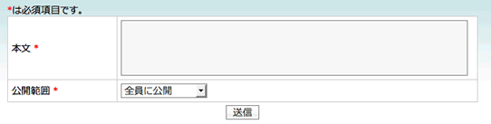

===============================
14日目 プライバシーコントロール
===============================

:Author: Shogo Kawahara <Twitter: @ooharabucyou>
:Date: 2010-12-14

SNSの内容や規模によっては、
ユーザのデータについてのプライバシーコントロールを考える必要があります。

ユーザのデータの公開範囲はユーザ自信が選ぶことができるようにしましょう。
また、アクセスブロックにも対応しなくてはいけません。

今回は、ユーザがミニ日記の公開範囲を
「全員に公開」か「フレンドまで公開」から選べるようにします。
アクセスブロックにより、データを閲覧できないようにもします。

フォームの修正
==============

``MiniDiaryForm`` を変更して、公開範囲を設定できるようにします。

``$your_plugin_dir/lib/form/doctrine/PluginMiniDiaryForm.class.php``

.. code-block:: php

  <?php

  abstract class PluginMiniDiaryForm extends BaseMiniDiaryForm
  {
    public function setup()
    {
      parent::setup();

      // 選択肢
      $publicFlagChoices = array(
        0 => '全員に公開',
        1 => 'フレンドまで公開'
      );

      $this->setWidget('public_flag', new sfWidgetFormChoice(array('choices' => $publicFlagChoices)));
      $this->setValidator('public_flag', new sfValidatorChoice(array('choices' => array_keys($publicFlagChoices))));

      $this->useFields(array('body', 'public_flag')); // body, public_flag を使う
    }
  }

:doc:`13_migrations` で追加した ``public_flag`` に公開範囲を保存するようにします。

``public_flag`` は 「全員に公開」か、「フレンドまで公開」から選択できるようにしたいので、
Widgetに、 ``sfWidgetFormChoice`` を、Validatorに、 ``sfValidatorChoice`` を指定します。

これにより、フォームが以下のようになります。

アクションの修正
================

アクセスブロックの対応
----------------------

:doc:`12_mobile` でアクションをまとめたので、修正する場所は一箇所です。

``$your_plugin_dir/lib/opSamplePluginMiniDiaryActions.class.php`` の一部

.. code-block:: php-inline

  public function executeShow(sfWebRequest $request)
  {
    $this->miniDiary = $this->getRoute()->getObject();

    $miniDiary = $this->miniDiary;

    if ($this->getUser()->getMemberId() === $miniDiary->getMemberId())
    {
      // 作成者と閲覧者が一致ならそのまま表示
      return sfView::SUCCESS;
    }

    // メンバーの関係を取得します。
    $memberRelationship = Doctrine::getTable('MemberRelationship')
      ->retrieveByFromAndTo($this->getUser()->getMemberId(), $miniDiary->getMemberId());

    // 閲覧者がミニ日記作成者にアクセスブロックされていたら 404
    $this->forward404If($memberRelationship && $memberRelationship->isAccessBlocked());
  }

公開範囲の対応
--------------

保存された ``public_flag`` を元に公開範囲設定が実際に動くようにします。

``$your_plugin_dir/lib/opSamplePluginMiniDiaryActions.class.php`` の一部

.. code-block:: php-inline

  public function executeShow(sfWebRequest $request)
  {
    $this->miniDiary = $this->getRoute()->getObject();

    $miniDiary = $this->miniDiary;

    if ($this->getUser()->getMemberId() === $miniDiary->getMemberId())
    {
      // 作成者と閲覧者が一致ならそのまま表示
      return sfView::SUCCESS;
    }

    // メンバーの関係を取得します。
    $memberRelationship = Doctrine::getTable('MemberRelationship')
       ->retrieveByFromAndTo($miniDiary->getMemberId(), $this->getUser()->getMemberId());

    // 閲覧者がミニ日記作成者にアクセスブロックされていたら 404
    $this->forward404If($memberRelationship && $memberRelationship->getIsAccessBlock());

    if (1 === (int)$miniDiary->getPublicFlag())
    {
      // 公開範囲が 1 (フレンドまで公開) なら 閲覧者と作成者がフレンドかどうかを確認する
      // フレンドでない場合は 404
      $this->forward404Unless($memberRelationship && $memberRelationship->isFriend());
    }
  }

テンプレートの表示
==================

公開範囲を設定していることを、閲覧者が知ることができるようにしましょう。
テンプレートを変更します。

PC
--

``$your_plugin_dir/apps/pc_frontend/modules/miniDiary/templates/showSuccess.php``

.. code-block:: php

  

  <?php
  // エスケープ済み
  echo nl2br($miniDiary->getBody())
  ?>
  

   by
  <?php
  echo op_link_to_member($miniDiary->getMember())
  ?>

  

  <?php if (1 === (int)$miniDiary->getPublicFlag()): ?>
  (フレンドまで公開)
  <?php else: ?>
  (全員に公開)
  <?php endif; ?>
  

  <?php if ($miniDiary->getMemberId() === $sf_user->getMemberId()): ?>
  

  <?php echo link_to('編集', '@mini_diary_edit?id='.$miniDiary->getId()) ?>
   <?php echo link_to('削除', '@mini_diary_delete_confirm?id='.$miniDiary->getId()) ?>
  

  <?php endif; ?>

モバイル
--------

``$your_plugin_dir/apps/mobile_frontend/modules/miniDiary/templates/showSuccess.php``

.. code-block:: php

  <?php op_mobile_page_title($miniDiary->getMember()->getName().'のﾐﾆ日記') ?>

  <?php
  echo nl2br($miniDiary->getBody())
  ?>

   
  <?php if (1 === (int)$miniDiary->getPublicFlag()): ?>
  (フレンドまで公開)
  <?php else: ?>
  (全員に公開)
  <?php endif; ?>

  

  <?php if ($miniDiary->getMemberId() === $sf_user->getMemberId()): ?>
  <?php echo link_to('編集', '@mini_diary_edit?id='.$miniDiary->getId()) ?> 
  <?php echo link_to('削除', '@mini_diary_delete_confirm?id='.$miniDiary->getId()) ?> 
  <?php endif; ?>
  <?php echo link_to($miniDiary->getMember()->getName().'のﾌﾟﾛﾌｨｰﾙ', '@obj_member_profile?id='.$miniDiary->getMemberId()) ?>

また明日
========

明日は、テストを取り扱います。
