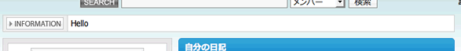

=======================
16日目 テンプレート拡張
=======================

:Author: Shogo Kawahara <Twitter: @ooharabucyou>
:Date: 2010-12-16

.. note:: 関連する symfony のドキュメント

  * `A Gentle Introduction to symfony | 第7章 ビューレイヤーの内側 <http://www.symfony-project.org/gentle-introduction/1_4/ja/07-Inside-the-View-Layer>`_

テンプレート拡張とは
====================

テンプレート拡張とは、テンプレートの特定の位置に、
コンポーネントや、パーシャルを挿入することができる機能です。

.. note:: パーシャル

  パーシャルはアクションを伴わない、テンプレートの部品です。

  パーシャルの利用は、 ``include_partial()`` ヘルパーを利用します。

  以下の例では、 ``sample`` モジュールの ``mypartial`` パーシャルを埋め込んでいます。

  この場合、 ``sample`` モジュールの ``templates/`` にある、 ``_mypartial.php`` が
  関数を呼び出した場所に埋めこまれます。

  .. code-block:: php

    <?php include_partial('sample/mypartial') ?>

  詳しくは以下のドキュメントを確認してください。

  * `A Gentle Introduction to symfony | 第7章 ビューレイヤーの内側 <http://www.symfony-project.org/gentle-introduction/1_4/ja/07-Inside-the-View-Layer>`_

OpenPNE3のデフォルトのテンプレートの多くは、パーツという部品が使われています。

フォームの埋込みに、利用した ``op_include_form()`` や ``op_include_yesno()`` は
フォーム用のパーツを埋め込むためのヘルパー関数です。

テンプレート拡張では、パーツの埋込みに利用した ID を元に、パーツの前後や
特定の箇所に、コンポーネントや、パーシャルを挿入します。

.. パーツの説明をもっと詳しく行う

実用例
======

インフォメーションボックスへの通知
----------------------------------

実際の利用例として、ホームのインフォメーションボックスのテンプレート拡張を行います。
インフォメーションボックスは、 "information" というIDで定義されているパーツです。

全てのパーツは、 ``top`` と ``bottom`` にテンプレートを追加することができます。
``top`` はパーツの上部で、 ``bottom`` はパーツ下部です。

また、パーツによっては独自の位置にテンプレート拡張を行うことができます。
インフォメーションボックスは本文の上部である、 ``bodyTop`` と 下部である ``bodyBottom`` という拡張箇所を持っています。

多くの場合、通知ではインフォメーションボックス本文の下部に指定のパーシャルを埋め込みます。

拡張するパーシャルを用意します。(もしくはコンポーネントを用意)

``$your_plugin_dir/apps/pc_frontend/modules/sample/templates/_helloPartial.php``

.. code-block:: php

  
Hello

``member`` モジュールの ``home`` で拡張を行うので、
プラグインに、 ``member`` モジュール用のディレクトリを作成します。

``$your_plugin_dir/apps/pc_frontend/module/member/`` には ``config/`` を作成し、
テンプレート拡張について設定する ``view.yml`` を作成します。

``$your_plugin_dir/apps/pc_frontend/module/member/config/view.yml``

::

  homeSuccess:
    customize:
      helloCustomize:
        # パーシャルを指定 [モジュール名, パーシャル名]
        # もしくは、コンポーネントを指定 [モジュール名, コンポーネント名]
        template: [sample, helloPartial]
        parts   : [information]
        target  : [bodyBottom]
        is_component: false # 埋め込むものがテンプレートなら true

キャッシュを削除します。

::

  $ cd $openpne_dir
  $ symfony cc

ホーム画面のインフォメーション欄に、作成したパーシャルが埋めこまれているかを確認して下さい。

また明日
========

明日は、管理画面についてを取り扱います。
