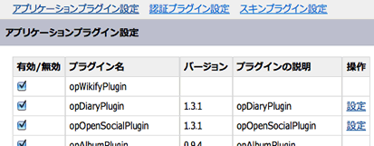

===============
17日目 管理画面
===============

:Author: Shogo Kawahara <Twitter: @ooharabucyou>
:Date: 2010-12-17

プラグインの管理画面
====================

プラグインごとにも管理画面を作成することができます。

アプリケーションの作成
----------------------

pc_backend のスケルトンを作成します。

::

  $ cd $openpne_dir
  $ php symfony opGenerate:app opSamplePlugin pc_backend

モジュールの作成
----------------

管理画面のプラグイン一覧の「設定」はプラグイン名と同じモジュール名が存在したときに表示されます。

::

  $ php symfony opGenerate:module opSamplePlugin pc_backend opSamplePlugin

これで、プラグイン一覧の ``opSamplePlugin`` の「設定」が有効になります。

.. image:: images/s17-2.png

なお、管理画面に作成されるモジュールはすべてログインが必要な状態に設定されています。

アクション・テンプレート
------------------------

アクション・テンプテートについてはとんどは frontend と同じように開発できますが、
テンプレート拡張は利用することはできません。

pc_backend はパーツを利用しないためです。
フォームの埋込みなどは、以下のように通常の symfony アプリケーションが行う方法を利用してください。

.. code-block:: php

  <?php echo $form->renderFormTag(url_for('XXXX')); ?>
  <table>
  <?php echo $form ?>
  </table>
  <input type="submit" />
  </form>

ルーティング設定
----------------

管理画面のプラグイン一覧の「設定」設定は、 ``/opSamplePlugin`` にリンクしています。

そのため、プラグインの設定から最初に開かれるアクションを ``/opSamplePlugin`` というURLで設定してください。

``$your_plugin_dir/apps/pc_backend/config/routing.yml``

例 ::

  op_sample_plugin_setting:
    url: /opSamplePlugin
    param: { module: opSamplePlugin, action: setting }

また明日
========

明日は、メールの送信を取り扱います。
