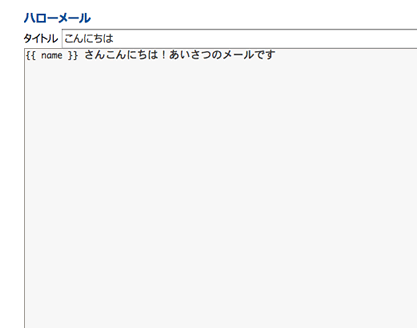

=======================
18日目 メールを送信する
=======================

:Author: Shogo Kawahara <Twitter: @ooharabucyou>
:Date: 2010-12-18

メールを送信する
================

単純にメールを送信する機能としては、 ``opMailSend::execute()``
を利用する方法があります。

.. code-block:: php-inline

  opMailSend::execute('Subject', 'to@sns.example.com', opConfig::get('admin_mail_address'), 'Body');

``opMailSend::execute()`` は至ってシンプルです。

* 第1引数には、メールの Subject を文字列で指定します。日本語文字コードについての変換は自動的に行われます。
* 第2引数には、メールの送信先を指定します。
* 第3引数には、メールの送信元を指定します。

  -  管理画面で設定した、SNS管理者のメールアドレスは ``opConfig::get('admin_mail_address')`` で取得することができます。

* 第4引数には、本文を指定します。日本語文字コードについての変換は自動的に行われます。

.. チラシの裏
  日本語文字コードに限定されている点は OpenPNE3 の悪しき問題だと思う。
  国際化に意欲のある人。ぜひとも opMailSend::execute() を改善してほしい。

メールテンプレートの利用
========================

SNS上から送られる通知メールの多くは、ある程度の定型文をもったもので、
かつSNS管理者がその内容を編集できる方が望ましいことが多くあります。

OpenPNE3では、プラグインからテンプレートを作成して、
送信の際に利用することができます。

テンプレートの定義
------------------

テンプレートは ``$your_plugin_dir/config/mail_template.yml`` で定義を行います。

テンプレートの Subject および 本文は `Twig <http://www.twig-project.org/>`_ の書式で記述します。

.. note:: Twig

  基本的なルール

  * 変数は ``{{ }}`` で囲む。
  * 変数がインスタンスであった場合 ``.`` でメンバ変数を呼ぶことができる。
  * 条件分岐は、 `` ... ``
  * 繰り返しは、 `` ... ``

  詳しくは以下を確認してください。

  * `Twig for Template Designers(英語) <http://www.twig-project.org/doc/templates.html>`_

``$your_plugin_dir/config/mail_template.yml``

::

  pc:                                # PC向け
    hello:                           # テンプレート名
      caption: "ハローメール"        # 管理画面で表示されるテンプレート名
      configurable: true             # true にすると管理画面から送受信設定を行うことができる
      title_configurable: true       # true にすると Subject を変更できます。
      sample:                        # デフォルトテンテンプレート
        ja_JP:                       # 日本語
          - "こんにちは"             # デフォルトのSubject
          - |                        # 本文
            {{ name }} さんこんにちは！あいさつのメールです
      variables:
        name: "受信者のニックネーム" # 管理画面で表示される変数の説明

  mobile:                            # モバイル向け 以下 PC向けと同様
    hello:
      caption: "ハローメール"
      configurable: true
      title_configurable: true
      sample:
        ja_JP:
          - "こんにちは"
          - |
            {{ name }} さんこんにちは！あいさつのメールです
      variables:
        name: "受信者のニックネーム"

この設定により、テンプレートの内容を管理画面の「メール設定」 -> 「メール通知テンプレート設定」
からテンプレートを編集することができます。

テンプレートの利用
------------------

.. code-block:: php-inline

  // member_id=1 のMember インスタンスを作成
  $member = Doctrine::getTable('Member')->find(1);

  // メールアドレスを取得 (配列)
  foreach ($member->getEmailAddresses() as $to)
  {
    // 送信
    opMailSend::sendTemplateMail('hello', $to, opConfig::get('admin_mail_address'), array('name' => $member->getName()));
  }

``opMailSend::sendTemplateMail()`` は以下のように使います。

* 第1引数には、テンプレート名を指定します。
* 第2引数には、メールの送信先を指定します。
* 第3引数には、メールの送信元を指定します。
* 第4引数には、テンプレートに利用するパラメータを配列で指定します。

送信先メールアドレスがモバイル向けの場合、モバイル向けのテンプレートを送ります。

また明日
========

明日は、メールの受信について取り扱います。
