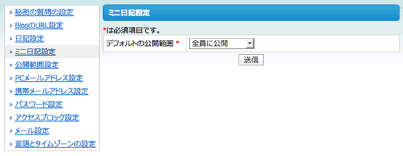

=======================
20日目 設定項目を増やす
=======================

:Author: Shogo Kawahara <Twitter: @ooharabucyou>
:Date: 2010-12-20

OpenPNE3にはSNSメンバーの設定項目を増やす機能が存在します。

設定項目の定義
==============

``$your_plugin_dir/config/member_config.yml`` でメンバーの設定項目を定義します。

今回は、ミニ日記のデフォルトの公開範囲についての変更を行えるようにしましょう。

``$your_plugin_dir/config/member_config.yml``

::

  miniDiary:                                       # 大分類名
    _attributes:
      caption: "ミニ日記設定"                      # 大分類キャプション
      enable_pc:     true                          # PCで設定できるか
      enable_mobile: true                          # モバイルで設定できるか
    default_mini_diary_public_flag:
      Name:       "default_mini_diary_public_flag" # 設定名
      Caption:    "デフォルトの公開範囲"           # デフォルトの公開範囲
      FormType:   "select"                         # FormType  (select, input, password)
      ValueType:  "integer"                        # ValueType (string, integer, password)
      IsRegist:   false                            # 登録時にこの設定を求めるか
      IsConfig:   true                             # 設定でこの設定ができるか
      IsRequired: true                             # 必須か
      IsUnique:   false                            # 重複を許可するか
      Default: 0                                   # デフォルト値
      Choices:                                     # 選択肢
        0: "全員に公開"
        1: "フレンドまで公開"

次に、この大分類用のFormクラスを作成します。

``MemberConfigForm`` を継承し、 ``MemberConfig大分類名Form`` という名前にします。

今回は、 ``MemberConfigMiniDiaryForm`` という名前になります。
protectedである ``$category`` という変数を、大分類名にしてください。

この設定フォームについて独自に行うアクションは特にないので、以下のようになります。

``lib/form/MemberConfigMiniDiaryForm.class.php``

.. code-block:: php

  <?php

  class MemberConfigMiniDiaryForm extends MemberConfigForm
  {
    protected $category = 'miniDiary';
  }

キャッシュを削除すると、設定が出来るようになります。

::

  $ cd $openpne_dir
  $ php symfony cc

設定の取得
==========

設定の取得は、 ``Member`` インスタンスの ``getConfig()`` メソッドで
行うことができます。

``$your_plugin_dir/lib/opSamplePluginMiniDiaryActions.class.php`` のミニ日記の新規作成アクションで
ユーザが設定した公開範囲がデフォルトになるように変更変更しましょう。

.. code-block:: php-inline

    // miniDiaryの作成画面
    public function executeNew(sfWebRequest $request)
    {
      $miniDiary = new MiniDiary();
      $miniDiary->setPublicFlag($this->getUser()->getMember()->getConfig('default_mini_diary_public_flag'));

      $this->form = new MiniDiaryForm($miniDiary);
    }

また明日
========

明日は、アクティビティについて取り扱います。
