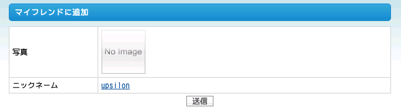
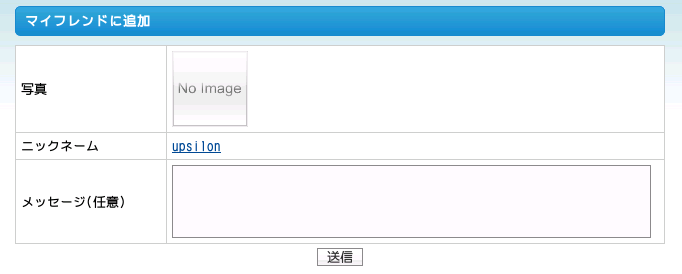

===============================
22日目 イベントディスパッチャー
===============================

:Author: Kimura Youichi <Twitter: @kim_upsilon>
:Date: 2010-12-22

ここまで opSamplePlugin を作成する過程で OpenPNE3 への機能の追加を行ってきました。
また 16 日目のテンプレート拡張では、マイページ内にあるインフォメーションボックスを拡張しました。
そのほかにも OpenPNE3 やフレームワークの symfony には本体やプラグインの機能を拡張するための仕組みが用意されています。

.. note:: 関連する symfony のドキュメント

  * `A Gentle Introduction to symfony | 第17章 - symfony を拡張する <http://www.symfony-project.org/gentle-introduction/1_4/ja/17-Extending-Symfony>`_

.. warning::

  この項はコミュニティの「イベント」とは一切関係ありません。

OpenPNE3 に用意されているイベント
=================================

OpenPNE3 では特定の操作を行うときに「イベント」が通知されます。
またプラグイン側では、あるイベントが発生したら事前に指定したメソッドを呼び出させる、ということができます。

以下に列挙したイベントは symfony 標準には含まれていない OpenPNE3 で新たに追加されたイベントです。

==================================================  ====================================================  ==============================================
           イベントの名前 (タイプ)                                         通知元                                                引数
==================================================  ====================================================  ==============================================
op_acl.unknown_community_public_flag (filter)       opCommunityAclBuilder                                 public_flag
op_activity.template.filter_body (filter)           opActivityHelper                                      body
op_activity.filter_body (filter)                    opActivityHelper                                      body
op_doctrine.{when}_{action}_{class} (notify)        opDoctrineEventNotifier                               -
op_confirmation.list (notifyUntil)                  opConfirmationAction                                  category, member
op_confirmation.list_filter (filter)                opConfirmationAction                                  category, member
op_confirmation.decision (notifyUntil)              opConfirmationAction                                  category, id, is_accepted
op_action.pre_execute_{module}_{action} (notify)    opExecutionFilter                                     moduleName, actionName, actionInstance
op_action.pre_execute (notify)                      opExecutionFilter                                     moduleName, actionName, actionInstance
op_action.post_execute_{module}_{action} (notify)   opExecutionFilter                                     moduleName, actionName, actionInstance, result
op_action.post_execute (notify)                     opExecutionFilter                                     moduleName, actionName, actionInstance, result
op_message_plugin.decorate_body (notifyUntil)       opMessagePluginFormatter (opMessagePlugin)            method, arguments
feeds_action.pre_execute (notify)                   feedsActions (opWebAPIPlugin)                         -
op_opensocial.addapp (notify)                       PluginApplication (opOpenSocialPlugin)                memberApplication, reason
op_opensocial.removeapp (notify)                    opOpenSocialApplicationActions (opOpenSocialPlugin)   memberApplication
op_point.add_point (notifyUntil)                    opPointUtil (opPointPlugin)                           member_id, addPoint, resultPoint, reason
op_chat.filter_message (filter)                     PluginChatContent (opChatPlugin)                      chat_content
==================================================  ====================================================  ==============================================

例えば SNS のメンバーが日記を閲覧するときは http://sns.example.com/diary/1 のようなURLにアクセスします。
このとき、サーバ側ではモジュール「diary」アクション「show」の処理が実行されますが、その直前に op_action.pre_execute と op_action.pre_execute_diary_show のイベントが、直後に op_action.post_execute と op_action.post_execute_diary_show が通知されます。

使い方
======

イベントが通知された時に自分のメソッドを呼び出してもらうためにはイベントリスナーを登録する必要があります。
登録する場所は、sfPluginConfiguration のサブクラス (後述) の内にすると簡潔に書けます。以下のように記述します。

.. code-block:: php

  $this->dispatcher->connect(イベント名, イベントリスナー(呼び出し先));

イベント発生によって呼び出される側 (イベントリスナー) のメソッドは以下のように記述します。

.. code-block:: php

  function listener(sfEvent $event, $values)
  {
    // 実行する処理
  }

使用例
======

ではイベントの仕組みによって、どのような拡張が可能になるのでしょうか。
OpenPNE3 に標準でインストールされる opMessagePlugin では、イベントの仕組みを利用してフレンド申請やコミュニティ参加などの既存のフォームに手を加えています。
何もプラグインが入っていない状態ではフレンド申請のフォームは下図のような表示ですが、

opMessagePlugin を有効にするとフォームに「メッセージ(任意)」の欄が増えます。

この拡張はフォームが通知する form.post_configure イベントを使用しています。
