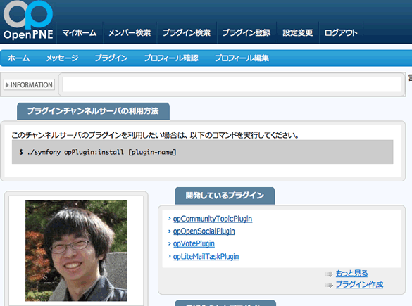

===============================
24日目 OpenPNE3の開発に貢献する
===============================

:Author: Shogo Kawahara <Twitter: @ooharabucyou>
:Date: 2010-12-24

今日まで、OpenPNE3.6 Advent を読んで、実際にハックしてくださった方の中には OpenPNE3 本体の問題点や疑問点を
感じた人も多くいることでしょう。

そのように感じた人は、ぜひとも OpenPNE3 の開発コミュニティに貢献しましょう。

OpenPNE3.6 Advent (2010) の締めくくりとして、貢献方法をまとめます。

貢献の方法
==========

バグを報告する
--------------

バグの報告は、オープンソースソフトウェアをより良くするための第一歩です。

最も良い方法は、 `OpenPNE Issue Tracking System <http://redmine.openpne.jp/>`_ にチケットを登録することです。

.. warning:: セキュリティに関わる問題点を発見してしまった時

  セキュリティに関わる問題を発見してしまったときは、
  その内容や修正案のパッチを security@openpne.jp にメールで送ってください。

  このメールは一部の開発者に届きます。
  具体的な攻撃手法を、対処法・回避策がはっきりするまで明らかにさせないためです。

  OpenPNE3は、セキュリティ的な問題を対処したときに
  バグフィックスなどと明確に区別するために *緊急リリース* を行います。

バグを報告するまえに、使用中のバージョンが今出ている最新のものかどうかを調べましょう。

管理画面にログインした後の下部にバージョンが表示されています。
それぞれのプラグインのバージョンは、管理画面からプラグイン設定に入ることにより
見ることができます。

以下のコマンドでもバージョンを調べることができます。

::

  $ cd $openpne_dir
  $ php symfony openpne:version

新しいチケットの登録は `こちら <http://redmine.openpne.jp/projects/op3/issues/new>`_ から行うことができます。

トラッカーはバグの報告の場合 ``Bug(バグ)`` にしてください。

タイトル(Subject) は具体的で簡潔なものにすると、対処者・マイルストーン管理者に伝わりやすくなります。

::

  OK - 管理画面でXXXという操作を行ったときにYYYに失敗する
  NG - 管理画面のバグ

詳細 (Description) は以下フォーマットに合わせて下さい。

::

  h3. Overview (現象)

  発生した現象を記入

  h3. Causes (原因)

  バグが発生した原因を記入

  h3. Way to fix (修正内容)

  修正内容を記入

さらに、以下の項目を記すことにより、対処者が問題を把握しやすくなります。

* 再現方法
* 環境

  - サーバの環境
  - OpenPNE3のバージョン
  - OpenPNE3同梱プラグイン
  - デザイン上の問題やブラウザに依存しそうな場合はブラウザのバージョン

具体的な解決策を理解している場合は、チケットにパッチを添付するか
Github上 で Pull Request を発行してください。

パッチの添付や、Pull Requestを行った場合、チケットのタイトルにの冒頭に
``[PATCH]`` としておくと、マイルストーン管理者が管理しやすくなり
対応がより早くなるでしょう。

.. note:: チケット作成のルールは `チケットを発行するには <http://redmine.openpne.jp/projects/op3/wiki/How_To_Report_Issue_%28ja%29>`_
  として明文化されています。

提案・相談する
--------------

OpenPNE3を良くする方法がある場合は是非、提言をしてください。

* `OpenPNE公式SNS <http://sns.openpne.jp/>`_ での発言
* メーリングリスト openpne-dev の利用
* OpenPNE開発IRCを利用する

.. note:: openpne-dev ML

  登録は `こちら <https://groups.google.com/group/openpne-dev?hl=ja>`_ から行うことができます。

  * `過去ログ <https://groups.google.com/group/openpne-dev?hl=ja>`_

.. note:: OpenPNE開発IRC

  irc://irc.friend-chat.jp:6667/openpne

  +server: irc.friend-chat.jp:6667 +channel: #openpne +encoding: UTF-8

自作プラグインを頒布する
------------------------

プラグインは、 `OpenPNE3プラグインチャネルサーバ <http://plugins.openpne.jp/>`_ に登録することにより、
利用者が簡単にインストールすることが出来るようになります。

プラグインチャネルサーバでは、プラグインを登録し、
パッケージをアップロードすることによりリリースすることができます。

パッケージの作成は、チャネルサーバ上でバージョン管理システム(Subversion, Git) を指定するか、
プラグイン開発者の環境で以下のコマンドを実行します。

::

  $ cd $openpne_dir
  $ php symfony opPlugin:release プラグイン名 パッケージ出力先path

その他の方法
------------

他にもOpenPNE3の開発に貢献する方法はたくさんあります。

このドキュメントの間違いを指摘したり、ブログでTipsをまとめることも
素晴らしい貢献方法の1つです。
